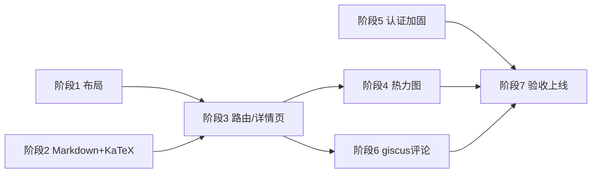

# Echoes 博客重构实施计划（PLAN）

> 基于现有架构：**纯静态单文件 `index.html` + Supabase**。以下计划在尽量不引入重型框架的前提下满足全部需求，并对与现有架构冲突的需求给出技术选型依据。

---

## 0. 关键架构决策（先读）

### 决策 1：认证方案 —— 必须引入"最小服务端"
需求 2 要求 **bcrypt 加盐哈希 + HttpOnly cookie + CSRF 保护**。静态页面无法设置 HttpOnly cookie（`document.cookie` 不支持 HttpOnly），硬编码密码也谈不上哈希存储。因此：

| 选项 | 说明 | 结论 |
|------|------|------|
| A. 纯前端（现状） | 密码硬编码、localStorage 开关 | ❌ 不满足需求 |
| B. Supabase Auth (GoTrue) | 密码哈希服务端完成，但 token 默认存 localStorage，HttpOnly cookie 需配合服务端框架 | ⚠️ 部分满足 |
| C. **Supabase Edge Functions 做认证端点** | `/login` `/logout` `/session` 三个函数：bcrypt 校验 → 签名 session token → `Set-Cookie: HttpOnly; Secure; SameSite=Strict`；CSRF 用 double-submit token | ✅ **推荐** |

**选型依据**：Edge Functions 与现有 Supabase 同生态、零额外运维、免费额度足够个人博客；相比自建 Node 服务器省去部署成本。bcrypt 使用 Deno 的 `bcrypt` 模块，哈希存于 Supabase `admin_config` 表（绝不暴露 anon key 可读——需 RLS 拒绝匿名读取）。

### 决策 2：Markdown 渲染 —— 不用 react-markdown
`react-markdown` 依赖 React 全家桶（~40KB+ runtime），而本项目是 **vanilla JS 单文件**，为渲染器引入 React 得不偿失。

| 选项 | 体积 | GFM | KaTeX | 结论 |
|------|------|-----|-------|------|
| react-markdown + remark-gfm | 需 React runtime | ✅ | 需 rehype-katex | ❌ 架构不匹配 |
| **markdown-it + markdown-it-texmath(KaTeX)** | ~30KB 单库 | 插件 | ✅ | ✅ **推荐** |
| marked + KaTeX auto-render | 更小 | 部分内置 | ✅ | 备选 |

**选型依据**：markdown-it 是 CommonMark 规范实现、插件生态成熟、支持通过 CDN 在纯 HTML 中使用，与现有"多 CDN fallback"加载模式一致。KaTeX 用官方 `auto-render` 扩展识别 `$...$` / `$$...$$`。

### 决策 3：路由 —— Hash 路由
静态托管（GitHub Pages 等）无法配置 SPA rewrite，`/post/123` 会 404。采用 **`#/post/:id` hash 路由**，零服务端依赖；详情页由同一个 `index.html` 客户端渲染（或拆分 `post.html` + `#/post/:id`）。

### 决策 4：评论 —— 选方案二 giscus
| | 方案一 Supabase 评论表 | 方案二 giscus |
|---|---|---|
| 实现复杂度 | 中高：建表 + RLS 策略 + 发布/列出 API + 前端表单 + **垃圾评论治理/审核** | **低**：一段 embed 脚本 + 仓库配置 |
| 身份体系 | 匿名（需自己防刷） | GitHub OAuth（自带防刷） |
| 数据归属 | 自己的库 | GitHub Discussions |
| 依赖 | 无新依赖 | 需公开仓库 + Discussions 开启 |

**结论**：个人博客场景下 giscus 复杂度低一个数量级且自带身份与反垃圾，**选方案二**。方案一作为后续可选增强（若需要匿名评论再实施，表结构需求中已给出）。

---

## 阶段 1：布局优化（低风险热身，~0.5 天）

**任务**
1. `.page-wrap` 左列 `260px → 200px`，`gap: 60px → 0.5rem`（即 margin-right 紧凑化）
2. `.post-item` 列表模式 `padding: 28px 0 → padding-bottom: 1.5rem`
3. 移动端断点同步调整

**测试检查点**
- [ ] 720px 以上两栏，侧边栏明显变窄、与列表间距收紧
- [ ] 720px 以下单栏无横向滚动条
- [ ] Chrome / Edge / 移动端模拟器三档宽度（375 / 768 / 1280）目测通过

---

## 阶段 2：Markdown 编辑器 + KaTeX（核心替换，~1.5 天）

**任务**
1. **DB 迁移**：`posts` 表新增 `content_md text`（原始 Markdown）；保留 `content` 列做旧数据兼容
2. 移除 Quill（CSS/JS/初始化），替换为 `<textarea>` + 等宽字体样式（后续可加 CodeMirror 预览分栏）
3. CDN 引入 `markdown-it`、`KaTeX` + auto-render，封装 `renderMarkdown(md)`：
   - markdown-it 开启 `html:false`（防 XSS）、`linkify:true`
   - 渲染后调用 `renderMathInElement(el, {delimiters: [{left:'$$',right:'$$',display:true},{left:'$',right:'$',display:false}]})`
4. 发布/编辑流程改写 `content_md`；列表摘要 = markdown 渲染后取纯文本前 120 字
5. **旧数据迁移脚本**（一次性 Edge Function 或本地脚本）：把现有 HTML `content` 简单转换为 Markdown 写回 `content_md`（`
`→段落、`<li>`→`-`、`<a>`→``、`<strong>/<em>`→`**/*`）

**测试检查点**
- [ ] 发布一篇含 **标题/列表/代码块/链接/图片** 的文章，详情页渲染正确
- [ ] 行内公式 `$E=mc^2$` 与块级公式 `$$\int_0^1 x^2 dx$$` 渲染为 KaTeX
- [ ] 含 `<script>` 的 Markdown 输入不被执行（XSS 检查）
- [ ] 3 篇旧文章迁移后内容无丢失
- [ ] CDN 全挂时降级显示原始文本而非白屏

---

## 阶段 3：路由与详情页（~1 天）

**任务**
1. 实现 hash 路由器：`#/`（列表）、`#/post/:id`（详情），监听 `hashchange`
2. 列表项只渲染 **标题 + 摘要（纯文本 ~120 字）+ 日期**，整块可点击 → `location.hash = '#/post/' + id`
3. 详情页视图：完整 Markdown 渲染 + KaTeX + 返回列表链接 + （阶段 6 的评论区挂载点）
4. `document.title` 随路由更新；不存在的 id 显示 404 视图

**测试检查点**
- [ ] 点击列表项 URL 变为 `#/post/<id>`，刷新后直达详情
- [ ] 浏览器前进/后退正常
- [ ] 直接访问 `#/post/不存在id` 显示 404 而非报错
- [ ] 列表页不再平铺全文

---

## 阶段 4：发布热力图（~0.5 天）

**任务**
1. 数据：`select raw_date, count(*) from posts group by raw_date`（Supabase 聚合查询，或拉取后前端聚合——文章量小，前端聚合即可，减少一次往返）
2. 渲染：过去 12 个月日历网格（7 行 × ~53 列），纯 CSS grid + `title` 提示
3. 色阶：`#ebedf0`（0 篇）→ `#9be9a8` → `#40c463` → `#39d353`（按当日数量分 4 档）
4. 放置于首页顶部 feed-header 下方，移动端横向可滚动

**测试检查点**
- [ ] 同日发布 2 篇显示更深色阶
- [ ] 悬停 tooltip 显示 "N 篇 · YYYY-MM-DD"
- [ ] 无文章日期为浅灰底色
- [ ] 移动端可横向滑动且不撑破布局

---

## 阶段 5：Admin 认证加固（安全关键，~1.5 天）

**任务**
1. **DB**：新建 `admin_config(id, password_hash, created_at)`，RLS 拒绝一切匿名访问；删除代码中的 `ADMIN_PASS` 常量
2. **Edge Functions**：
   - `POST /login`：body `{password, csrf}` → `bcrypt.compare` → 生成随机 session token（存 `sessions` 表或签名 JWT）→ `Set-Cookie: session=...; HttpOnly; Secure; SameSite=Strict; Max-Age=86400` + 返回 CSRF token
   - `POST /logout`：清除 cookie + 作废 session
   - `GET /session`：校验 cookie，返回 `{authenticated, csrfToken}`
3. **CSRF**：double-submit —— 登录后下发 `csrf_token`（内存中），所有写操作（publish/edit/delete）请求带 `X-CSRF-Token` 头，Edge Function 校验与 session 绑定的值一致
4. **前端**：齿轮按钮 → 登录表单（密码输入 + 错误提示 + 简单限速：连续 5 次失败锁定 5 分钟）；登录态改为查询 `/session` 而非 localStorage
5. **密码复杂度**：设置/修改密码时校验 ≥8 位且含大小写字母和数字（服务端校验为准，前端仅提示）
6. 删除 `localStorage AUTH_KEY` 逻辑，`isAdmin` 全部改为 `/session` 结果驱动

**测试检查点**
- [ ] 错误密码 5 次后被限速
- [ ] 登录后 DevTools → Application → Cookies 中 session cookie 显示 **HttpOnly ✓**，JS `document.cookie` 读不到
- [ ] 未带 `X-CSRF-Token` 的删除请求被 403 拒绝
- [ ] 未登录直接调用 Supabase 写接口被 RLS 拒绝（需同步收紧 `posts` 表 RLS：匿名只读、写操作仅经 Edge Function 用 service role）
- [ ] `admin_config` 表匿名 `select` 返回空/401（哈希不泄露）
- [ ] 8 小时后 session 过期需重新登录

---

## 阶段 6：评论（giscus，~0.5 天）

**任务**
1. 仓库开启 GitHub Discussions；安装 giscus App
2. 在 [giscus.app](https://giscus.app) 生成配置（repo / repoId / categoryId，映射 `pathname`）
3. 详情页底部挂载 `<script src="https://giscus.app/client.js" ...>`（仅 `#/post/:id` 路由时插入，离开路由时清理）
4. 深色/纸色主题适配（`light` 或自定义主题 CSS 变量）

**测试检查点**
- [ ] 详情页出现评论区，GitHub 登录后可发表
- [ ] 不同文章评论区独立（Discussion 按 pathname 映射）
- [ ] 列表页不加载 giscus 脚本
- [ ] 未配置 GitHub 登录时显示引导而非报错

---

## 阶段 7：整体验收与上线（~0.5 天）

**任务**
1. 全量回归：发布 → 列表 → 详情 → 评论 → 编辑 → 删除 全链路
2. 性能：确认 README 中"加载慢"问题——字体加 `display=swap`（已有）、依赖库按路由懒加载（详情页才加载 KaTeX/markdown-it）
3. 清理：移除 Quill 残留 CSS、旧 `content` 列数据确认迁移后可归档

**验收清单**
- [ ] Lighthouse：Performance ≥ 85，Best Practices ≥ 90
- [ ] XSS / CSRF / 越权写 三项安全自查通过
- [ ] 移动端全流程可用

---

## 里程碑与依赖关系

- 阶段 2 是阶段 3 的前置（详情页渲染依赖 Markdown 管线）
- 阶段 5 独立可并行，但必须在上线前完成（安全项）
- 总预估：**~6 个工作日**

## 风险与对策
| 风险 | 对策 |
|------|------|
| Edge Functions 冷启动导致登录慢 | 可接受（仅登录时调用）；必要时换 Vercel Functions |
| 旧 HTML→Markdown 迁移丢格式 | 迁移前导出 `posts` 全量备份；迁移后人工核对 3 篇 |
| `$` 与普通美元符号冲突 | KaTeX auto-render 配置忽略转义；文档中约定 `\$` |
| giscus 需要公开仓库 | 若仓库必须私有，回退到方案一（表结构已定义） |
